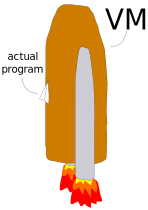

# `flame-llvm`: an LLVM back-end for Flame

[](https://travis-ci.org/jonathanvdc/flame-llvm)

`flame-llvm` is a tool that compiles [Flame](https://github.com/jonathanvdc/Flame) IR to [LLVM](http://llvm.org) IR using [LLVMSharp](https://github.com/Microsoft/LLVMSharp). Since [`ecsc`](https://github.com/jonathanvdc/ecsc) can compile C# source code to Flame IR, `flame-llvm` can (indirectly) turn C# programs into fast and small standalone binaries.

This repository also contains an implementation of a small but growing set of functionality from the .NET base class library (BCL) to offer some measure of source-level compatibility with C# code written for traditional CLR implementations.

## The case for `flame-llvm`

Running managed languages in a virtual machine like .NET or Mono works great for a wide class of applications. But for some programs, it just doesn't make sense.

For example, suppose that you wanted to re-implement the GNU coreutils. It's been done in [Go](https://github.com/ericlagergren/go-coreutils), [Rust](https://github.com/uutils/coreutils) and even [Haskell](https://github.com/mrak/coreutils.hs). But creating *a competitive C# version* of the coreutils would be rather tricky because most of the coreutils are:
  * short-lived applications (so their **start-up time** matters),
  * **small** (e.g., the `echo` command is about 34 KiB) and
  * **standalone** (they don't require a separate virtual machine to be installed before you can run them).

Mono and .NET Core can create standalone applications by bundling a VM with the actual program, but that's rather clumsy because the VM tends to be way bigger than the actual program. And using a VM adds to a program's start-up time regardless of whether you bundle it with the program or ship it separately. Also, bundling VMs with applications is just a hacky way to create an ersatz standalone program.



Enter `flame-llvm`, which you can use to compile C# code directly to a native executable. Programs compiled with `flame-llvm` run directly on the metal, and they're generally fast and small, too.

Here's a head-to-head comparison of `flame-llvm` and Mono's `mkbundle` tool on the `stdlib-echo` test (a simplified version of `echo`).

```bash
# Follow the build instructions in the `Compiling a C# program`
# section of the README to compile `stdlib-echo.cs` to `a.out`
# using `flame-llvm`.

# Use `mkbundle` to create a standalone version of `stdlib-echo.cs`.
$ mcs stdlib-echo.cs
$ mkbundle --simple stdlib-echo.exe -o stdlib-echo-mono

$ time ./a.out howdy
howdy

real 0m0.004s
user 0m0.004s
sys  0m0.000s

# a.out is less than 14 KiB
$ wc -c a.out
13752 a.out

$ time ./stdlib-echo-mono howdy
howdy

real 0m0.041s
user 0m0.028s
sys  0m0.008s

# stdlib-echo-mono is over 7 MiB
$ wc -c stdlib-echo-mono
7827636 stdlib-echo-mono
```

As you can see, compiling `stdlib-echo.cs` with `flame-llvm` results in an executable that starts up ten times faster and is five hundred times smaller than the executable produced by `mkbundle`. 

## Compiling `flame-llvm`

To use `flame-llvm`, you'll need to have the following installed:

  * basic command-line tools like `bash`, `make`, `cp`, etc (in your `$PATH`),
  * a .NET framework implementation (for example, [Mono](http://www.mono-project.com/)),
  * `clang`,
  * the Boehm-Demers-Weiser GC (Debian package: `libgc-dev`),
  * the `libc++abi` library (or equivalent) and
  * **LLVM 4.0**'s `libLLVM.(so|dll|dylib)`, whichever is appropriate for your platform. It doesn't really matter where you/an installer/your package manager put it; we'll copy it to the output directory.

For Debian-based distributions, the following command should install all dependencies:

```bash
sudo apt install mono-devel llvm-4.0-dev clang-4.0 libc++abi-dev libgc-dev
```

Clone `flame-llvm`, including its submodules, like so

```bash
git clone --recursive https://github.com/jonathanvdc/flame-llvm
cd flame-llvm
```

Now configure the LLVM dependency and build `flame-llvm`.

```bash
./build-libs.sh /path/to/libLLVM.so
make
```

You probably also want to compile the standard library.

```bash
make stdlib
```

Alternatively, you can use the MSBuild solution file (`flame-llvm.sln`) to build `flame-llvm` and then manually copy `libLLVM.(so|dll|dylib)` to the output directory, but I recommend using the Makefile.

## Compiling a C# program

Compiling a program with `flame-llvm` consists of multiple steps so it's kind of tricky to get right. Assuming you've built the standard library, the following should work. You probably want to wrap all of this into a neat little makefile.

```bash
# First, compile the source code to Flame IR.
ecsc program.cs --platform ir -Wno-build --rt-libs /path/to/flame-llvm-repo/stdlib/bin/flo/corlib.flo -o program.flo

# Compile the Flame IR to LLVM IR, linking in the core library.
flame-llvm program.flo /path/to/flame-llvm-repo/stdlib/flo/corlib.flo --platform llvm -Wno-build --rt-libs /path/to/flame-llvm-repo/runtime/bin/flo/runtime.flo
-o program.ll

# Compile the LLVM IR to an executable. Link in the runtime and libgc.
clang program.ll /path/to/flame-llvm-repo/runtime/bin/native/runtime.o -lgc -lc++abi -pthreads -Wno-override-module -o a.out
```

## Feature status

`flame-llvm` is not feature-complete yet, but it is mature enough to compile basic programs. Here's a feature list.

  - [x] integer arithmetic
  - [x] floating-point arithmetic
  - [x] control flow (`while`, `for`, `if`, `break`, `continue`, etc)
  - [x] direct function calls
  - [x] `extern` functions
  - [x] `struct` values
  - [x] `class` values
  - [x] `enum` values
  - [x] arrays
  - [x] support for strings
  - [x] conservative garbage collection (Boehm-Demers-Weiser GC)
  - [x] inheritance
  - [x] dynamic casts, `is`, `as`
  - [x] `virtual` calls
  - [x] `interface` calls
  - [x] generics
  - [x] boxing/unboxing
  - [x] `static` constructors
  - [x] exception handling (`throw`, `try`, `catch`, `finally`)&mdash;Itanium ABI (Linux, Mac OS X) only for now
  - [x] indirect function calls (delegates)
  - [ ] finalizers
  - [ ] reflection
  - [ ] precise garbage collection

## Contributing

Your contribution to `flame-llvm` would be most welcome! If you want to help out but have questions, head over to the [CONTRIBUTING.md](CONTRIBUTING.md) file or simply drop me an issue.
